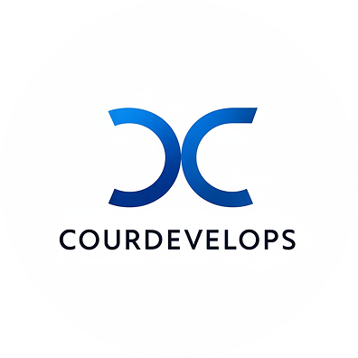
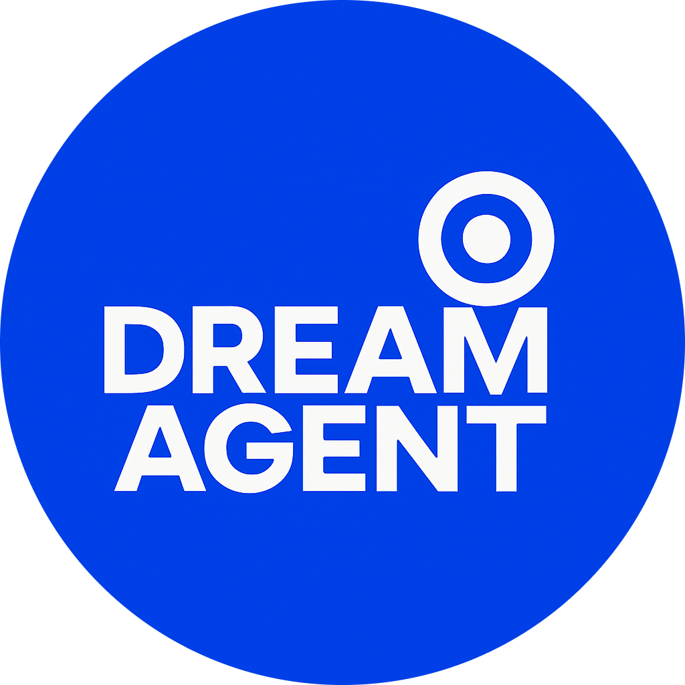

# Courtney Jacobs

Founder — CourDevelops

Builder of creative technology systems and AI-powered tools.

---

## 🚀 Main Projects

###  Origin OS

A creator-focused operating system for AI generation, asset management, and publishing.

Core platform built with Node.js, Express, MongoDB, and modular dashboard architecture.

---

###  dreamagent.art

Website and publishing platform created for the anonymous digital surrealist project Dream Agent.

Built using custom frontend architecture and deployed via Netlify.

---

###  CourDevelops

Creative technology studio focused on workflow-first digital ecosystems for artists and creators.

## 🧰 Tech Stack

Node.js  
Express  
MongoDB  
JavaScript  
REST APIs  
AI workflow integration

## 🌐 Links

CourDevelops  
https://courdevelops.com

Dream Agent Platform  
https://dreamagent.art

### Origin OS
https://github.com/courthub74/origin-os

